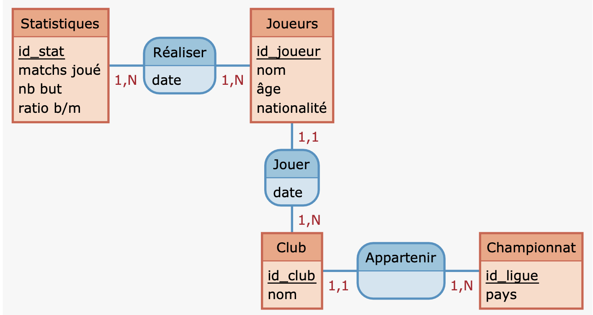
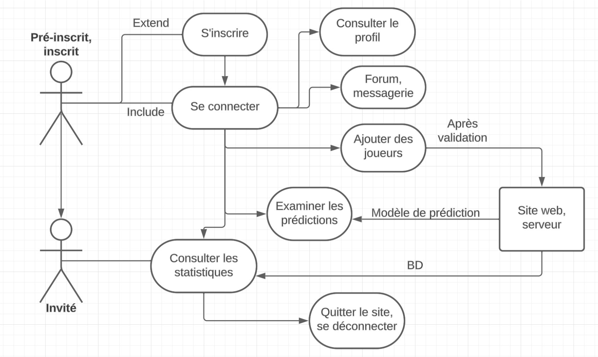

## Plannification des tâches semestre 1

Pour la création de notre site web nous devons commencer par établir plusieurs points :

- Objectif du projet

## Plannification des tâches semestre 1

Pour la création de notre site web nous devons commencer par établir plusieurs points :

- Objectif du projet

- Recherche, modifications et modélisation des données

## Plannification des tâches semestre 1

Pour la création de notre site web nous devons commencer par établir plusieurs points :

- Objectif du projet

- Recherche, modifications et modélisation des données

- Mise en place d'un schéma d'utilisation, création des maquettes

## Objectif

- Notre solution.

## Objectif

- Notre solution.
- Qui seront nos usagers et comment y accéder ?

## Objectif

- Notre solution.
- Qui seront nos usagers et comment y accéder ?
- A quoi notre site servira ?

## Objectif

- Notre solution.
- Qui seront nos usagers et comment y accéder ?
- A quoi notre site servira ?
- Existe-il déjà des solutions semblables ?

## Nos données

Lien : https://www.kaggle.com/datasets/mohamedhanyyy/top-football-leagues-scorers

## Nos données

Lien : https://www.kaggle.com/datasets/mohamedhanyyy/top-football-leagues-scorers

Modifications apportées à cette base:

- Plusieurs colonnes et lignes supprimées.

- Ajout de colonnes pour l'étude de la base.

## Moodélisation

## Diagramme des cas d'utilisations UML

## Maquettes

Nous allons voir une représentation visuelle pour donner une idée concrète de ce à quoi pourrait ressembler notre site.

Lien : https://www.figma.com/file/ImgZR8tOh3xOZ4KduE3N9c/Untitled?type=design&node-id=0-1&mode=design&t=xKoyeVFhEyObjTPr-0

## Prochaine tâche prévue

Au second semestre, nous devrons coder notre site web :

- Programmation HTML, PHP

## Prochaine tâche prévue

Au second semestre, nous devrons coder notre site web :

- Programmation HTML, PHP
- Importation des données, création de contenu

## Prochaine tâche prévue

Au second semestre, nous devrons coder notre site web :

- Programmation HTML, PHP
- Importation des données, création de contenu
- Test et débogages, lancement du site

